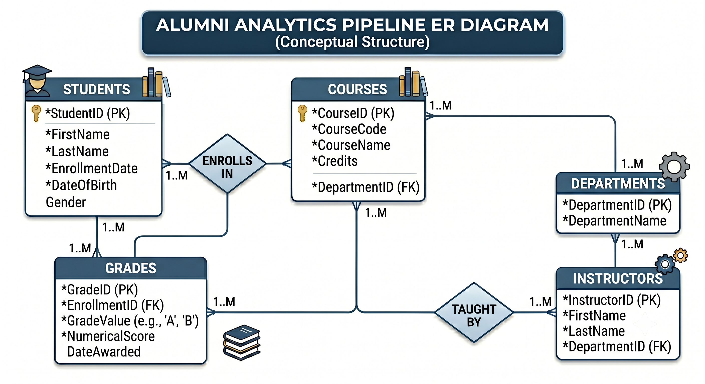

# Academic Alumni Anlaytics Pipeline

## 📌 Project Overview
This project involves architecting, implementing, and optimizing a robust relational transactional database schema (OLTP) designed to manage institutional academic layers. The system normalizes core transactional entities (Students, Instructors, Courses, and Enrollments), enforces strict referential boundaries, and builds an optimized backend structure capable of supporting student progress tracking and administrative performance analytics.

---

## 🛠️ Tech Stack & Engineering Core
* **Database Engine:** MySQL / Relational Storage Engine
* **Architectural Principles:** 3rd Normal Form (3NF), Entity-Relationship Constraints, Referential Data Integrity.


---

## 🏗️ Relational Architecture & Entity Boundaries
The database infrastructure is built on a highly normalized structure to eliminate data redundancy and prevent data leakage across administrative domains:

* **`departments` (Domain Anchor):** Maps primary organizational groups, routing department names and administrative heads.
* **`students` (Master Entity):** Centralizes demographic identities, enrollment timestamps, and unique institutional tracking attributes.
* **`instructors` (Master Entity):** Tracks institutional faculty assignments, linked directly to their specializing organizational departments via a Many-to-One relationship.
* **`courses` (Curriculum Ledger):** Manages the core curriculum catalog, tracking credit weighting and mapping course instances to hosting departments and assigned instructors.
* **`enrollments` (Many-to-Many Junction Table):** Manages the complex intersection layer between students and courses. Tracks temporal registration vectors and absolute numeric grading metrics while maintaining system-wide referential integrity.

---

## ⚙️ Data Engineering Features Implemented
* **Referential Integrity Cascades:** Configured explicit `FOREIGN KEY` boundaries using `ON DELETE CASCADE` and `ON DELETE SET NULL` policies to handle record deletions gracefully without leaving orphaned logs.
* **Domain Check Validations:** Enforced database-level rules to handle system boundaries (e.g., credit value thresholds, strict email format parameters, and grade point scales).
* **Storage-Optimized Types:** Utilized exact numeric and string variable lengths (`INT UNSIGNED`, `VARCHAR`, `DECIMAL`) to reduce memory footprints and maximize query performance during analytical scans.

---

## 🚀 Execution Guide
To initialize the relational architecture and populate the structural constraints locally:

1. Ensure your active database workbench or command-line instance is running.
2. Execute the initialization batch file to build the system framework and seed the testing data:
   ```sql
   SOURCE alumni-schema-init.sql;
